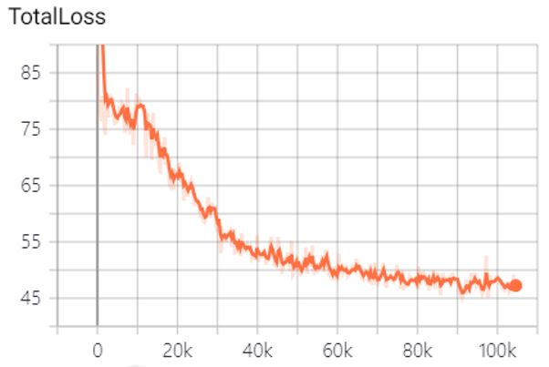
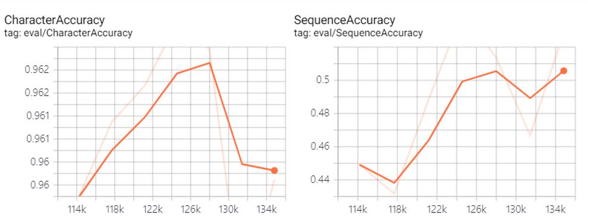

# Attention_OCR_KOR

## The progress was used to Korean OCR based on Google Attention OCR.

Modify [Google's attention model](https://github.com/tensorflow/models/tree/master/research/attention_ocr) for Korean text recognition.

More details can be found in this paper - ["Attention-based Extraction of Structured Information from Street View Imagery"](https://arxiv.org/abs/1704.03549)

This project can run on Windows10, using the python3 environment and The network is built using tensorflow


## How to use your own image data to train the model
```
cd python
python train.py --dataset_name=newtextdataset
```

### Loss Function


  
## Verify your own model
Verify your own model
```
python eval.py
```
The results can be view used tensorboard
```
tensorboard  --logdir=/tmp/attention_ocr/eval
```

### Accuracy


## Use a trained model
```
python demo_inference.py --batch_size=32 \
  --checkpoint=model.ckpt-192211\
  --image_path_pattern=./datasets/data/fsns/temp/~~~.png
```


